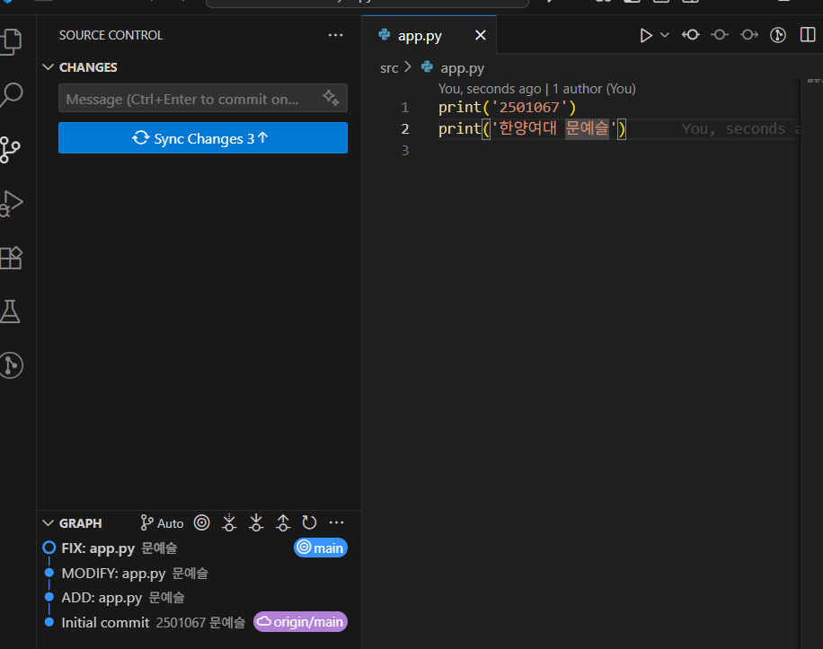
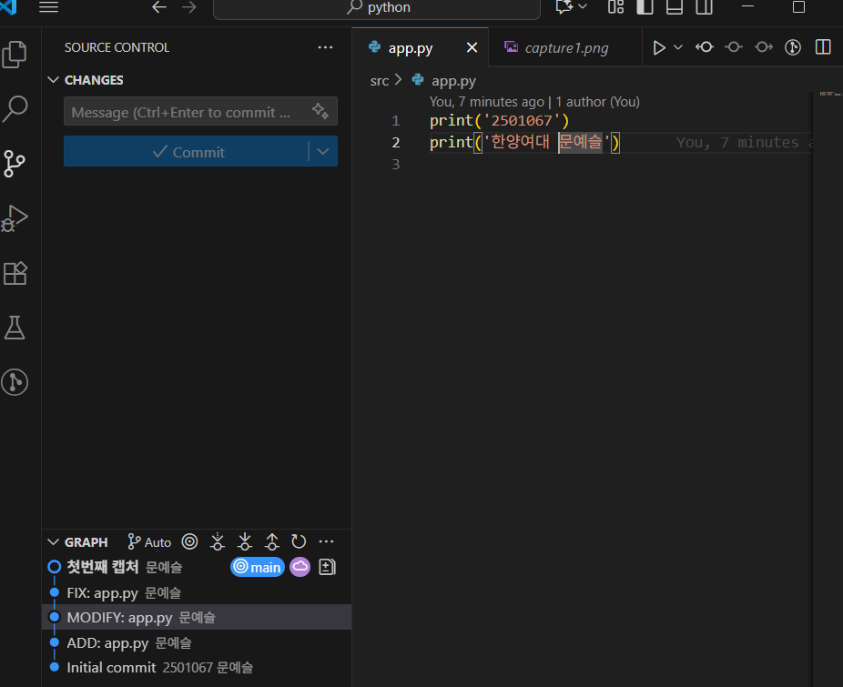

# python

# Python GitHub 과제

## 1. 과제 개요
- VS Code에서 Python 프로젝트를 생성하고 Git/GitHub을 활용하여 버전 관리 및 저장소 연동을 실습한다.  
- commit 메시지 규칙:  
  - 첫 번째: `ADD: app.py`  
  - 이후 기능 추가: `MODIFY: app.py`  
  - 코드 수정: `FIX: app.py`  

---

## 2. 프로젝트 폴더 구조
```
project_root/
 ├─ src/
 │   └─ app.py
 ├─ doc/
 │   └─ images/
 │       ├─ capture1.png
 │       └─ capture2.png
 └─ README.md
```

---

## 3. 수행 과정
1. **src/app.py 작성 및 첫 commit**
   - commit 메시지: `ADD: app.py`  
   - 기능: [print('2501067')]  

2. **두 번째 commit**
   - commit 메시지: `MODIFY: app.py`  
   - 수정/추가한 내용: [print('문예슬')]  

3. **세 번째 commit**
   - commit 메시지: `FIX: app.pyy`  
   - 수정/추가한 내용: [print('한양여대 문예슬')]  

---

## 4. 캡처 이미지
- `capture.png` → commit 완료 상태 화면  
- `capture2.png` → GitHub push → pull 후 VS Code 화면  

예시:  
  
  

---

## 5. GitHub Repository URL
- URL: [https://github.com/YeSeul-06/python.git]  

---

## 6. 느낀 점 (선택 사항)
- 이번 과제를 하면서 배운 점: 깃 배시뿐만 아니라 vs코드에서도 깃허브를 연결시킬수 있다는 것을 알게 되었다. 저번 과제 1,2는 소스트리를 이용했다면 이번엔 vs코드를 이용했는데 내가 생각하기엔 vs코드를 이용하는게 더 쉬운것 같다.
- Git/GitHub을 활용하며 어려웠던 점: 책에서는 깃 배시를 이용하였고 우린 vs코드를 사용하여 좀 어렵다. 하지만 과제를 내 주시면서 계속 실패하다가 성공하니 뿌뜻함과 동시에 이게 맞나 싶기도 하면서, 점점 공부하는 느낌이 든다.
- 앞으로 더 해보고 싶은 것: 깃과 깃허브를 더 자세하게 알고 싶다. 책과 교수님 강의도 참고하지만, 더 쉬운 방법이 있는지도 궁금하다.
